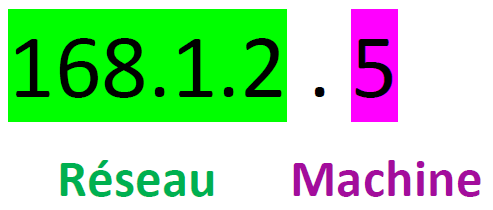
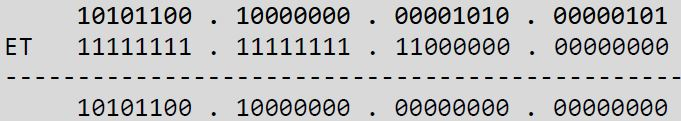
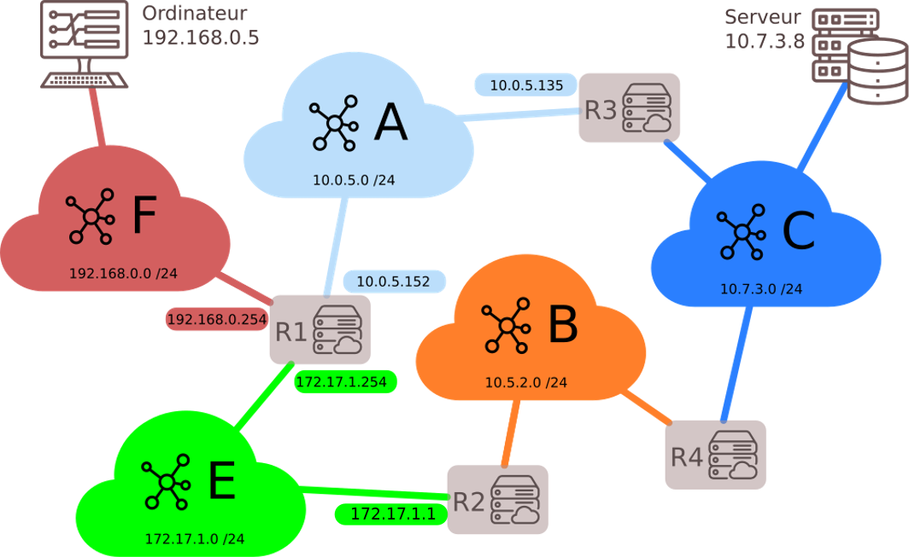
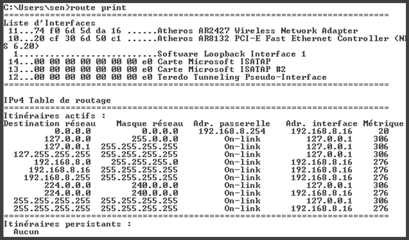
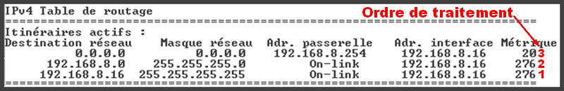

## I. Quelques rappels
### Modèle client-serveur

!!! info "Modèle client-serveur" 

    Les clients échangent des informations avec les serveurs. La notion de client recouvre aussi bien une machine, qu'une application. 

    De même le serveur désigne aussi bien l'ordinateur qui héberge un service que le logiciel qui fournit ce service.

### Protocole

!!! info "Protocole"

    Les protocoles sont l'ensemble des règles utilisées par les clients et les serveurs pour communiquer.

### Paquets

!!! info "Paquets"

    Les informations échangées sont découpées en paquets de petites tailles. Ces paquets sont envoyés séparément et transitent sur le réseaux indépendamment les uns des    autres.
    Ils peuvent parvenir à destination dans le désordre, le protocole doit donc prévoir des fonctions pour reconstituer l'information. 

## II. Routeurs et topologie d'un réseau

En plus des clients et des serveurs, le réseau est constitué de switchs (commutateurs) et de routeurs.  
Ces machines reçoivent et transmettent l'information vers la destination.

Les clients et les serveurs communiquent avec les routeurs (Ethernet, wifi...)

<iframe width="635" height="357" src="https://www.youtube.com/embed/JqweQE6TDTc" frameborder="0" allow="accelerometer; autoplay; encrypted-media; gyroscope; picture-in-picture" allowfullscreen></iframe>

Regarder la vidéo suivante

<a target="wims_external" href="https://www.lumni.fr/video/l-architecture-des-reseaux-et-les-protocoles-de-communications#containerType=serie&containerSlug=la-maison-lumni-lycee">architecture des réseaux</a>

### Adresse IP

!!! info "Adresse IP"

    &#128073; Chaque machine sur le réseau est identifiée par une adresse IP. La norme actuelle est IPv4, la migration est en cours
    vers IPv6.

    Dans la norme IPv4 l'adresse est codée sur 32 bits (4 octets), soit 4 entiers de 0 à 255 (car 255 en base 10 s'écrit 1111 1111 en base 2)

    Exemple d'adresse IP : 168.1.2.10

### 1. Masque de sous réseau

!!! info "Masque de sous réseau"

    L'adresse IP est en réalité composée de **2 parties** : l'adresse **du réseau**, et l'adresse **de la machine sur le réseau**. 

    &#128073; Le masque permet de connaitre la partie réservée à l'adresse du réseau.

!!! info "Masque de sous réseau : notations"

    Il existe deux façons de noter le masque. 

    ???+ note "Première notation possible avec l'adresse du masque"

        **&#128161; Première notation possible :** IP = 168.1.2.5   mask = 255.255.255.0 

        Dans cet exemple très simple, les valeurs 255 indiquent la partie réseau, les 0 indiquent la partie identifiant la machine sur le réseau. 

        { width=20% }

        Dans l'exemple ci-dessus 168.1.2.0 est l'adresse du réseau, seul le dernier nombre identifie une machine.

        Dans ce cas-là, toute adresse 168.1.2.x identifiera une machine sur le réseau. x peut prendre 256 valeurs, ce sous réseau peut donc 
        connecter 254 machines car il y a deux **adresses réservées** :  
        
        * 👉 adresses réservées 168.1.2.0 celle du réseau, obtenue avec uniquement des 0 sur la plage d'adressage machines
        * 👉 168.1.2.255 celle du broadcast (adresse réservée pour une diffusion sur toutes les machines du réseau) obtenue avec uniquement des 1 sur la plage d'adressage  machines.  

    ???+ note "Deuxième notation possible : notation CIDR"

        &#128073; On peut aussi noter le masque de la façon suivante : 168.1.2.0/24

        **/24** indique que 24 bits sont utilisés pour l'adresse réseau. Les 8 bits restant codent donc l'adresse machine.

        &#128512; On peut avec cette notation plus simple, utiliser une très faible quantité d'information pour l'adresse machine. Cela est
        préconisé pour un routeur, qui ne gère généralement pas un très grand nombre de machines.

        10.1.2.5/30 indiquera par exemple que l'adresse réseau est codée sur 30 bits, seulement 2 bits (4 valeurs possibles) sont utilisables pour des machines. C'est très    peu !

### Un exemple détaillé :

!!! example " Un exemple détaillé"

    Considérons la machine dont la configuration réseau est : IP : 172.128.10.5 ; Masque : 255.255.192.0 .  
    On écrit de façon plus courante : 172.128.10.5/18  
    On obtient l'adresse du sous réseau avec l'opérateur AND.  

    Écrivons en binaire l'adresse IP et le masque :  
    $172.128.10.5$ s'écrit en binaire :  $10101100.10000000.00001010.00000101$  
    $255.255.192.0$ s'écrit en binaire : $11111111.11111111.11000000.00000000$  

    Posons l'opération du ET logique entre l'adresse IP de la machine et le masque :  

    { width=50% .center}

    On met en décimal le résultat : $172.128.0.0$  est l'adresse du réseau.  

    La seconde partie nous permet de savoir combien de machines peut contenir ce réseau.  
    On peut aller de $000000.00000000$ à $111111.11111111$.  
    En décimal : de 0 à 16383. C'est à dire 16384 adresses possibles...  

    &#127797; Enfin pas tout à fait :

    * Il faut retirer l'adresse du réseau lui-même : $172.128.0.0$ 
    * Il faut également retirer (la dernière ) l'adresse de broadcast :  $10101100.10000000.00111111.11111111$ c'est à dire l'adresse $172.128.63.255$

    Donc en tout : on peut connecter 16382 machines dans ce réseau.

???+ question "Exercice papier"

    On donne l'adresse IP d'un matériel suivante : Adresse IP : 192.168.1.100/20  
    
    Déterminer : 

    1. le masque de sous-réseau
    2. l'adresse du réseau
    3. le nombre de machines que l'on peut connecter à ce réseau
    4. l'adresse broadcast
    5. l'adresse IP de la première machine
    6. l'adresse IP de la dernière machine

    ??? success "Solution"

        Adresse IP : 192.168.1.100/20  
        En binaire : 11000000.10101000.00000001.01100100

        1. Le masque de sous-réseau est :
        11111111.11111111.11110000.00000000  
        c'est à dire en décimal :  
        255.255.240.0  
            
        2. L'adresse du réseau :    
        11000000.10101000.00000001.01100100    
         AND  
        11111111.11111111.11110000.00000000   
        👉  
        L'adresse du réseau est donc :  
        1100000.10101000.00000000.00000000  
        c'est à dire en décimal :  
        192.168.0.0   
              
        3. Le nombre de machines que l'on peut connecter à ce réseau :  
        La dernière adresse possible pour la plage réservée aux adresses machines est 1111  11111111
        On peut donc connecter $2^{12} -2  = 4094$ machines
            
        4. L'adresse broadcast est donc  
        11000000.10101000.00001111.11111111  
        C'est à dire en décimal : 192.168.15.255  
        
        5. L'adresse IP de la première machine est  
        11000000.10101000.00000000.00000001  
        C'est à dire en décimal : 192.168.0.1  
              
        6. L'adresse IP de la dernière machine est   
        11000000.10101000.00001111.11111110  
        C'est à dire en décimal : 192.168.15.254  

### Deux routeurs liés par un câble

!!! danger "Attention"

    &#127797; Même si entre deux routeurs, il n’y a rien d’autre qu’un câble, ce câble constitue un réseau.  
    En pratique ce réseau pourrait avoir pour masque 255.255.255.252 (en CIDR /30) .  
    Sur un tel réseau, il n’y a donc que quatre adresses possibles. Etant donné que deux sont prises pour le réseau et le broadcast, il n’en reste que deux pour connecter des matériels. Ce seront donc les deux adresses IP des routeurs, qui se termineront donc forcément par .1 et .2 (l’adresse se terminant par .0 étant celle du réseau, et celle se terminant par .3 celle du broadcast)  

## III. Tables de routages

!!! info "Table de routage"

    Lorsqu'un routeur reçoit un paquet, il doit l'analyser pour savoir où l'envoyer. Pour le savoir, il utilise une <b class="blue">table de routage</b>.  
    Les tables de routage sont des informations stockées dans le routeur permettant d&#39;aiguiller intelligemment les données qui lui sont transmises.  
    Dans le réseau ci-dessous, si l&#39;ordinateur d&#39;adresse \(192.168.0.5\) veut interroger le serveur \(10.7.3.8\) :  

    * l&#39;adresse \(10.7.3.8\) n&#39;étant pas dans le sous-réseau F (d&#39;adresse \(192.168.0.0\) / \(24\)), la requête est confiée au routeur via son adresse passerelle  dans le réseau F (ici \(192.168.0.254\)).
    * le routeur observe si l&#39;IP recherchée appartient à un autre des sous-réseaux auquel il est connecté. Ici, l&#39;IP recherchée \(10.7.3.8\) n&#39;appartient ni au sous-réseau A ou E. 
    * le routeur va donc regarder dans sa table de routage l&#39;adresse passerelle d&#39;un autre routeur vers qui il doit rediriger les données. 
    * Si le sous-réseau C fait partie de sa table de routage, le routeur R1 saura alors que le meilleur chemin est (par exemple) de confier les données au routeur R3.
    * Si le sous-réseau C ne fait pas partie de la table de routage, le routeur R1 va alors le rediriger vers une route «par défaut» (que l&#39;on peut assimiler au panneau «toutes directions» sur les panneaux de signalisation).

???+ note dépliée passerelle ou gateway

    &#128073;A la place de "passerelle", vous trouverez souvent le mot anglais "<b>gateway</b>"

!!! example " Plusieurs réseaux"

    { width=80% .center}

    Il y a plusieurs possibilités. Par exemple, regardons la table de routage  du routeur R1.  

    &#128073; A priori, on ne met pas de passerelle pour les réseaux auxquels le routeur R1 est directement connecté.

    <b> Table de routage de R1</b>
    <table width = 40%>
    <thead>
    <tr>
    <th>Destination   </th>
    <th>Passerelle  </th>
    <th>Interface </th>
    </tr>
    </thead>
    <tbody>
    <tr>
    <td>192.168.0.0 /24</td>
    <td> </td>
    <td>192.168.0.254 ou i1</td>
    </tr>
    <tr>
    <td>172.17.1.0 /24</td>
    <td> </td>
    <td>172.17.1.254 ou i2</td>
    </tr>
    <tr>
    <td>10.0.5.0 /24</td>
    <td> </td>
    <td>10.0.5.152 ou i3</td>
    </tr>
    <tr>
    <td>10.5.2.0 /24</td>
    <td>172.17.1.1</td>
    <td>172.17.1.254 ou i2</td>
    </tr>
    <tr>
    <td>10.7.3.0 /24</td>
    <td>10.0.5.135</td>
    <td>10.0.5.152 ou i3</td>
    </tr>
    </tbody>
    </table>

!!! abstract "Résumé"

    L’interface c’est l’adresse de la carte réseau par où on sort, la passerelle (gateway) c’est le prochain endroit (adresse de la carte réseau du routeur) où on va.  
    Les interfaces ne sont pas identifiées par leur adresse IP mais par leur nom (qui peut être de la forme eth0, wlo1, i1, etc.). Dans les sujets d'exercices, on peut     trouver les interfaces identifiées par leur adresse IP.

!!! info "&#128161; Comment sont construites les tables de routage ?"

    * Soit à la main par l&#39;administrateur réseau, quand le réseau est petit : on parle alors de table <strong>statique</strong>.
    * Soit de manière <strong>dynamique</strong> : les réseaux s&#39;envoient eux-mêmes des informations permettant de mettre à jour leurs tables de routages 
    respectives. Des algorithmes de détermination de meilleur chemin sont alors utilisés : nous allons en découvrir deux, le protocole <b class="blue">RIP</b> (peu utilisé)  et le protocole <b class="blue">OSPF</b>.

!!! example " Reprenons notre exemple :"

    

    l'ordinateur d'adresse \(192.168.0.5\) veut interroger le serveur \(10.7.3.8\) :
     Le protocole <b>RIP</b> va permettre d'établir la route avec le plus faible nombre de <b>sauts</b>. Cela signifie que la route choisie sera celle
    qui passe par le plus faible nombre de routeurs. Dans notre exemple, le chemin choisi sera donc R1 - R3 
    

    

    Le protocole <b>OSPF</b> tient compte des vitesses de transmission, et permet de déterminer la route la plus rapide en temps de transmission, 
    qui n'est donc pas nécessairement celle avec le plus faible nombre de sauts.
    

      Source : Gilles LASSUS

!!! info "Pourquoi des protocoles ?"

    

    Il pourrait sembler simple de configurer les routeurs à la main. On indiquerait par exemple à R3 ou envoyer les paquets
    selon les destinations. En cas de changement du réseau (ajout d'un nouveau routeur, panne d'un routeur, etc...) il faudrait
    alors maintenir à la main la table de routage. Cela serait sans doute faisable dans un tout petit réseau, mais le nombre de routeurs
    d'un réseau est généralement beaucoup trop grand pour qu'on puisse envisager cela, même avec un nombre important
    d'humains passant leur temps à communiquer entre eux les changements pour mettre à jour les tables.
    

    

    Il est donc nécessaire que les routeurs maintiennent leur tables à jour de façon automatique. C'est ce à quoi servent les
    protocoles de routage.
    
 

!!! info "Les approches possibles"

    
On pourrait imaginer plusieurs façons d'aborder le problème :

    <ul>
    <li>Le routage aléatoire : Les routeurs pourraient très bien envoyer les paquets à un de leurs voisins choisi de façon aléatoire, en espérant que, tôt ou tard, le paquet   arrivera à destination.
    Cela peut sembler idiot, mais même un tel protocole peut dans certaines situations critiques se révéler la 
    meilleure option.
    C'est le cas si le réseau contient peu de machines, et que les connections sont très instables. Dans de telles conditions
    chercher à conserver une carte du réseau efficace serait illusoire.</li>
    <li>Le routage centralisé : chaque routeur indique de façon périodique l'état de ses connexions avec ses voisins. Le routeur
    central dispose ainsi de toutes les informations et peut en retour indiquer aux routeurs les routes optimales. 
    Ce système serait le plus efficace mais il a un gros défaut : il faut que tous les routeurs puissent communiquer avec le
    routeur central, et cela à tout moment. Une panne de liaison d'un ou plusieurs routeurs aboutira à une cartographie
    erronée. Pire encore, le routeur central lui même peut tomber en panne, paralysant alors le réseau.
    </li>
    <li>Le routage par apprentissage de proche en proche : les routeurs ne communiquent qu'avec leurs voisins. Chacun donne à tous
    ses voisins la liste de ses voisins, et reçoit en retour la même liste. Il ajoute alors dans sa table la liste des voisins de ses voisins
    (en éliminant ceux qu'il a déjà en voisin lui même). Pour chaque destination, il ajoute l'information sur la distance. 
    Il pourra transmettre sa nouvelle table ainsi mise à jour, et le processus continuera par étape jusqu'à ce que tous les routeurs puissent 
    calculer les routes vers tout les autres.
     
    Chaque routeur testera périodiquement les connexions avec ses voisins. Si une nouvelle connexion apparait, ou si une connexion
    existante disparait, il mettra à jour sa table, et il transmettra l'information à ses voisins. De proche en proche, la modification
    du réseau sera ainsi répercutée dans les tables de routages de tous les routeurs.
    </li></ul>

## IV. La route par défaut : 0.0.0.0/0

!!! info "0.0.0.0"

    Dans le contexte de routage, 0.0.0.0 (ou 0.0.0.0/0 en notation CIDR) signifie généralement la route par défaut.

    Wikipedia Table de routage : 

    > La route par défaut indiquera comment acheminer le trafic qui ne correspond à aucune entrée dans la table de routage. En l’absence de route par défaut, le routeur éliminera un paquet dont la destination n’est pas connue. »

    La destination 0.0.0.0/0 représente donc souvent "le reste d'internet", plutôt qu'une adresse du réseau local.

!!! example "Exemple"

    Table de routage d'un ordinateur sous Windows 7 obtenue avec la commande <b>route print</b>

    { width=90% .center}

    
Cette table peut se d&eacute;composer de la mani&egrave;re suivante :

    <ul>
	<li>Destination : Plage d'adresse de destination d&eacute;termin&eacute;e par le couple Destination r&eacute;seau / Masque r&eacute;seau</li>
	<li>Adresse passerelle : Adresse du routeur qui permet d'atteindre le r&eacute;seau de destination.</li>
	<li>Adresse interface : Carte r&eacute;seau &agrave; utiliser pour contacter le routeur mentionn&eacute; dans "Adresse passerelle".</li>
	<li>M&eacute;trique : Indique le co&ucirc;t relatif de l'itin&eacute;raire pour atteindre la destination</li>
    </ul>
    
Si on exclu les informations de broadcast, loopback et multicast, la table pr&eacute;c&eacute;dente peut se r&eacute;sumer &agrave; :
    

    { width=90% .center}

    L'ordre de traitement de la table de routage va des masques les plus longs aux plus petits. C'est à dire que le routeur va d'abord comparer les sous-réseaux avec le masque 255.255.255.255 pour finir par comparer les sous-réseaux avec le masque 0.0.0.0.
    
    
La table de routage simplifi&eacute;e ci-dessus peut se traduire ainsi (dans l'ordre de traitement) :

    <ol>
    <li>Route vers l'ordinateur lui-m&ecirc;me, "Destination r&eacute;seau" et "Adresse interface" ont la m&ecirc;me valeur. On remarquera le masque enti&egrave;rement &agrave; 255 (/32 en CIDR) qui permet de d&eacute;signer un r&eacute;seau (une plage) limit&eacute;e &agrave; une seule adresse.</li>
    <li>Route vers le r&eacute;seau local sur lequel est connect&eacute; l'ordinateur. "On-link" indique que l'ordinateur est directement connect&eacute; au r&eacute;seau concern&eacute;, il n'y a donc pas besoin de routeur pou l'atteindre.</li>
    <li>Route par d&eacute;faut 0.0.0.0/0.0.0.0 : c'est la route utilis&eacute;e si aucune autre route possible n'a &eacute;t&eacute; trouv&eacute;e dans la table de routage.  </li>
    </ol>

    
Source : 
    <a target="wims_external" href="https://www.electro-info.ovh/index.php?id=137">https://www.electro-info.ovh/index.php?id=137</a>

???+ question "&#128187; A vous de jouer chez vous :"

    
Sur votre ordinateur personnel, chez vous, dans la barre de recherche du bas, saisissez <b>cmd</b>, puis une fois l'invite de commande  apparue, saisissez <b> route print </b>
      Essayez de comprendre ce qui s'affiche.

    
<b>Remarque</b>
     sous GNU/Linux, la commande <b>route -n </b> renvoie le même style de tableaux.

