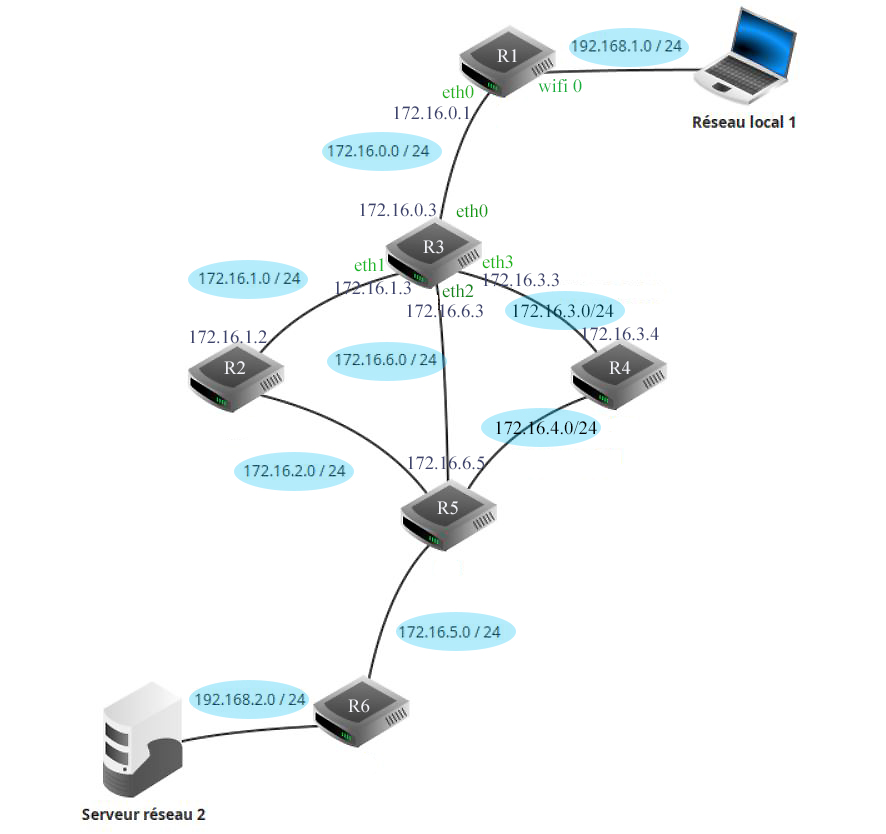
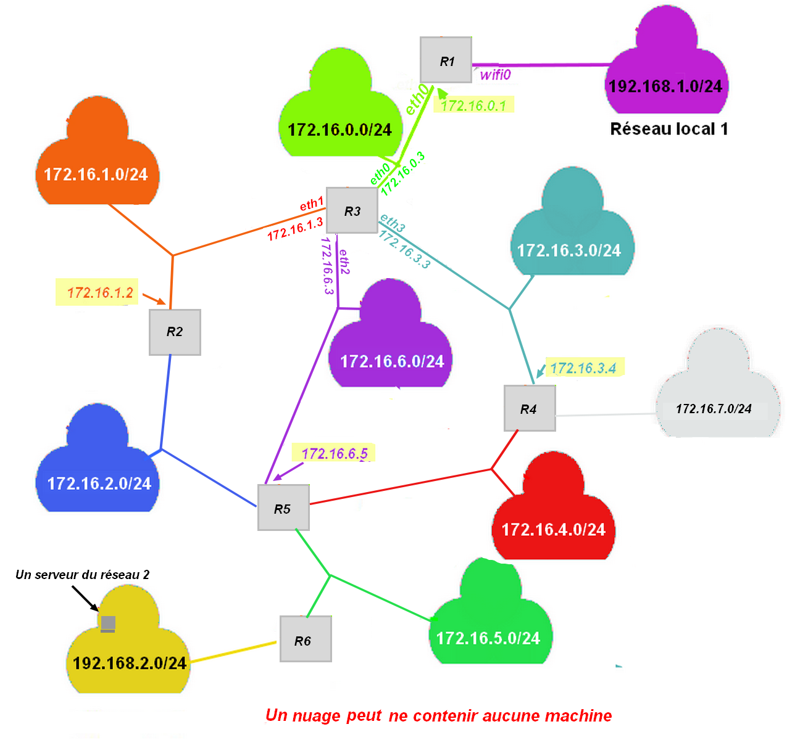
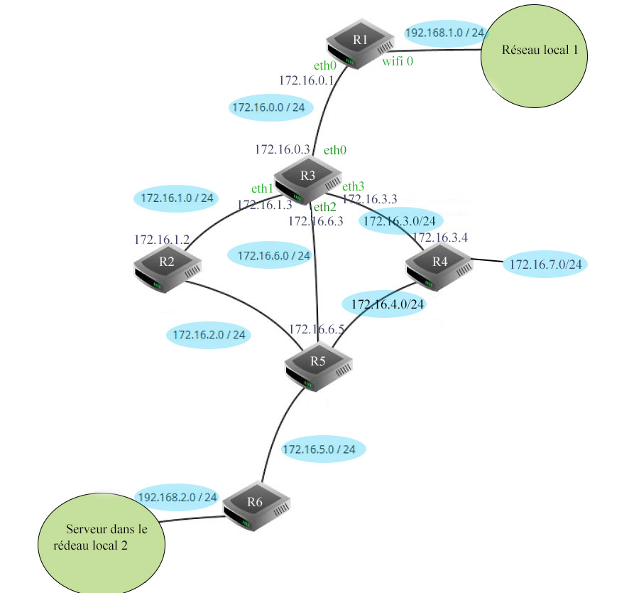

## I. Protocole RIP à vecteur de distance

???+ note "RIP"

    **RIP** : **R**outing **I**nformation **P**rotocol

??? note "Auteur"

    Le document qui suit sur le protocole RIP a été réalisé d'après le site réalisé par Olivier LECLUSE 

!!! info "Vecteur de distance"

    Le protocole **RIP** rentre dans la catégorie des protocoles **à vecteur de distance**. Un vecteur de distance est un couple **(adresse, distance)**.

    Le principe simplifié de ce protocole est de chercher à minimiser le nombre de routeurs à traverser pour atteindre la destination (on minimise le nombre de **sauts**)

!!! info "Principe général de l'algorithme"

    &#127939;&#8205;&#9792;&#65039; Chaque routeur reçoit en permanence (toutes les 30 secondes environ) de ses voisins les informations de routage qu'ils possèdent. Il va    alors exploiter ces informations pour se construire lui-même sa table de routage en ne retenant que les informations les plus pertinentes : une simple comparaison permet de ne garder que le chemin le plus avantageux. Il transmettra a son tour ces informations à ses voisins et ainsi de suite.

    C'est l'algorithme de [Belman-Ford](https://fr.wikipedia.org/wiki/Algorithme_de_Bellman-Ford) : un des algorithmes de recherche de plus court chemin dans un graphe.

    &#127939;&#8205;&#9792;&#65039; A l'issue de quelques étapes, les tables se stabilisent et le routage est pleinement opérationnel. Le temps nécessaire à la stabilisation des tables est proportionnel au diamètre du graphe modélisant le réseau (c'est à dire au nombre maximal d'étapes nécessaires pour relier deux points quelconques du réseau).

&#128083; Regardez cette vidéo de Claude Chaudet (Institut Mines-Télécom) qui expose le principe du routage à vecteur de distance.

<iframe width="560" height="315" src="https://www.youtube.com/embed/kzablGaqUXM" frameborder="0" allow="accelerometer; autoplay; encrypted-media; gyroscope; picture-in-picture" allowfullscreen></iframe>

!!! info "Quand un routeur ne répond plus"

    Quand un routeur ne répond plus, il n’est pas supprimé de la table, quelle qu’en 
    soit la raison (routeur défectueux, câble coupé, carte ethernet HS, etc.). 

    Avec le protocole RIP, le nombre de saut dans la table passe juste à 16.

## II. Exemple: 

Considérons le réseau suivant qui relie deux réseaux d'une entreprise :

<ul>
<li>le réseau 1 contient des postes de travail dans un bureau.</li>
<li>le réseau 2 contient un serveur dans un centre de données.</li>
</ul>

Les routeurs R1 et R6 permettent d'accéder au réseau de l'entreprise, R2, R3, R4 et R5, des routeurs internes au réseau.

{ width=95% .center}

Nous allons nous intéresser à l'évolution des tables de routage des routeurs **R1** et **R3** sur lesquels on a activé le protocole **RIP**

Vous pouvez télécharger l'image de ce réseau ici : ["Clic droit", puis "Enregistrer la cible du lien sous"](a_telecharger/exemple2_v3.jpg)

## Étape 0

Au démarrage, les routeurs R1 et R3 ne connaissent que leurs voisins proches. Leurs tables peuvent donc ressembler à ceci :

<aside>
<b class="red">Attention :</b> La "distance" (ou nombre de sauts) peut être considérée comme le nombre d'arrêtes (c'est le cas ci-dessous) 
ou comme le nombre de routeurs traversés (dans ce cas, il faut retrancher 1 dans la colonne nombre de saut ci-dessous). 
Comme souvent, vous pourrez rencontrer les 2 conventions. La plus commune est de compter le nombre de routeur traversés.
</aside>

<b>Routeur R1</b>

<table width = 60%>
<thead><tr>
<th>destination</th>
<th>passerelle</th>
<th>interface</th>
<th>Nb sauts</th>
<th>remarques</th>
</tr>
</thead>
<tbody>
<tr>
<td>192.168.1.0</td>
<td></td>
<td>wifi0</td>
<td>1</td>
<td>==&gt; vers les postes de travail</td>
</tr>
<tr>
<td>172.16.0.0</td>
<td></td>
<td>eth0</td>
<td>1</td>
<td>==&gt; vers R3</td>
</tr>
</tbody>
</table>

Au départ, R1 ne peut atteindre que ses voisins immédiats (nb Sauts vaut 1). Aucune passerelle n'est 
nécessaire puisque la communication est directe. Chaque sous réseau utilise une interface spécifique. 
Le réseau local 1 contenant les postes de travail est accessible en wifi.

 
<b>Routeur R3</b>

En ce qui concerne le routeur 3, celui-ci possède 4 interfaces réseau filaires, que nous nommerons <em>eth0-3</em> qui 
permettent d'atteindre les routeurs immédiats (R1, R2, R4 et R5). Voici à quoi peut ressembler sa table de routage au démarrage :

<table width= 40%>
<thead><tr>
<th>destination</th>
<th>passerelle</th>
<th>interface</th>
<th>Nb sauts</th>
<th>remarques</th>
</tr>
</thead>
<tbody>
<tr>
<td>172.16.0.0</td>
<td></td>
<td>eth0</td>
<td>1</td>
<td>==&gt; vers R1</td>
</tr>
<tr>
<td>172.16.1.0</td>
<td></td>
<td>eth1</td>
<td>1</td>
<td>==&gt; vers R2</td>
</tr>
<tr>
<td>172.16.6.0</td>
<td></td>
<td>eth2</td>
<td>1</td>
<td>==&gt; vers R5</td>
</tr>
<tr>
<td>172.16.3.0</td>
<td></td>
<td>eth3</td>
<td>1</td>
<td>==&gt; vers R4</td>
</tr>
</tbody>
</table>

## Étape 1

Au bout de 30 secondes, un premier échange intervient avec les voisins immédiats de chacun des routeurs.

!!! info "Le principe de l'algorithme"

    Lorsqu'un routeur reçoit une nouvelle route de la part d'un voisin, 4 cas sont envisageables :

    * Il découvre une route vers un nouveau **réseau inconnu**  
    👉 Il l'ajoute à sa table.  
    * Il découvre une route vers un réseau **connu, plus courte que celle qu'il 
    possède dans sa table**   
    👉 Il actualise sa table.
    * Il découvre une route vers un réseau **connu plus longue que celle qu'il 
    possède dans sa table**   
    👉 Il ignore cette route.
    * Il reçoit une route vers un réseau **connu en provenance d'un routeur 
    déjà existant dans sa table**  
    👉 Il met à jour sa table car la topologie du réseau a été modifiée.
    

En appliquant ces règles, voici la table de routage de R1 après une étape :

<b> Routeur R1</b>

<table width = 60%>
<thead><tr>
<th>destination</th>
<th>passerelle</th>
<th>interface</th>
<th>Nb sauts</th>
<th>remarques</th>
</tr>
</thead>
<tbody>
<tr>
<td>192.168.1.0</td>
<td></td>
<td>wifi0</td>
<td>1</td>
<td>==&gt; vers les postes de travail</td>
</tr>
<tr>
<td>172.16.0.0</td>
<td></td>
<td>eth0</td>
<td>1</td>
<td>==&gt; vers R3</td>
</tr>
<tr>
<td>172.16.1.0</td>
<td>172.16.0.3</td>
<td>eth0</td>
<td>2</td>
<td>Ces 3 routes</td>
</tr>
<tr>
<td>172.16.6.0</td>
<td>172.16.0.3</td>
<td>eth0</td>
<td>2</td>
<td>proviennent</td>
</tr>
<tr>
<td>172.16.3.0</td>
<td>172.16.0.3</td>
<td>eth0</td>
<td>2</td>
<td>de R3</td>
</tr>
</tbody>
</table>

 172.16.0.3 est l'adresse IP du routeur R3. 
 On ajoute à la table précédente les réseaux atteignables par R3. On pense cependant à ajouter 1 au nombre de sauts !
 Si R1 veut atteindre le réseau 172.16.3.0, il s'adressera à R3 et atteindra le réseau cible en 2 sauts.

Voici la table de R3 qui s'enrichit des informations envoyées par R1 afin d'atteindre le réseau local, mais aussi
des informations en provenance de R2, R4 et R5. Il découvre ainsi 4 nouveaux réseaux.

<b> Routeur R3</b>

<table width = 60%>
<thead><tr>
<th>destination</th>
<th>passerelle</th>
<th>interface</th>
<th>Nb sauts</th>
<th>remarques</th>
</tr>
</thead>
<tbody>
<tr>
<td>172.16.0.0</td>
<td></td>
<td>eth0</td>
<td>1</td>
<td></td>
</tr>
<tr>
<td>172.16.1.0</td>
<td></td>
<td>eth1</td>
<td>1</td>
<td></td>
</tr>
<tr>
<td>172.16.6.0</td>
<td></td>
<td>eth2</td>
<td>1</td>
<td></td>
</tr>
<tr>
<td>172.16.3.0</td>
<td></td>
<td>eth3</td>
<td>1</td>
<td></td>
</tr>
<tr>
<td>192.168.1.0</td>
<td>172.16.0.1</td>
<td>eth0</td>
<td>2</td>
<td>reçu de R1</td>
</tr>
<tr>
<td>172.16.2.0</td>
<td>172.16.1.2</td>
<td>eth1</td>
<td>2</td>
<td>reçu de R2</td>
</tr>
<tr>
<td>172.16.5.0</td>
<td>172.16.6.5</td>
<td>eth2</td>
<td>2</td>
<td>reçu de R5</td>
</tr>
<tr>
<td>172.16.4.0</td>
<td>172.16.3.4</td>
<td>eth3</td>
<td>2</td>
<td>reçu de R4</td>
</tr>
</tbody>
</table>

### Dernière étape

Comme vous le voyez, les tables deviennent vite longues et énumérer dans le détail chacune d'elle est trop long.
 &#128168; On va donc passer directement à l'étape finale . Voici ce que contient la table de routage de R1 :

<b> Routeur R1</b>

<table width = 60%>
<thead><tr>
<th>destination</th>
<th>passerelle</th>
<th>interface</th>
<th>Nb sauts</th>
<th>remarques</th>
</tr>
</thead>
<tbody>
<tr>
<td>192.168.1.0</td>
<td></td>
<td>wifi0</td>
<td>1</td>
<td>==&gt; vers les postes de travail</td>
</tr>
<tr>
<td>172.16.0.0</td>
<td></td>
<td>eth0</td>
<td>1</td>
<td>==&gt; vers R3</td>
</tr>
<tr>
<td>172.16.1.0</td>
<td>172.16.0.3</td>
<td>eth0</td>
<td>2</td>
<td></td>
</tr>
<tr>
<td>172.16.6.0</td>
<td>172.16.0.3</td>
<td>eth0</td>
<td>2</td>
<td></td>
</tr>
<tr>
<td>172.16.3.0</td>
<td>172.16.0.3</td>
<td>eth0</td>
<td>2</td>
<td></td>
</tr>
<tr>
<td>172.16.2.0</td>
<td>172.16.0.3</td>
<td>eth0</td>
<td>3</td>
<td> </td>
</tr>
<tr>
<td>172.16.4.0</td>
<td>172.16.0.3</td>
<td>eth0</td>
<td>3</td>
<td> </td>
</tr>
<tr>
<td>172.16.5.0</td>
<td>172.16.0.3</td>
<td>eth0</td>
<td>3</td>
<td>obtenu à l'étape 2</td>
</tr>
<tr>
<td>192.168.2.0</td>
<td>172.16.0.3</td>
<td>eth0</td>
<td>4</td>
<td>obtenu à l'étape 3</td>
</tr>
</tbody>
</table>

Comme vous le voyez, le routeur R1 est à présent en capacité d'acheminer un paquet du poste de travail du réseau 1 vers le serveur se trouvant dans le réseau 2.

## III. Fonctionnement

### Détection des pannes

!!! info "Détection des pannes"

    Le protocole RIP est en mesure de détecter des pannes : Si un routeur ne reçoit pas d'information de la part d'un de ses voisins au bout d'un temps de l'ordre de 3 minutes (configurable) il va considérer que ce lien est mort et en informer ses voisins en indiquant un nombre de sauts égal à 16. Puisque RIP ne gère que 15 sauts au maximum, 16 peut être considéré comme une distance infinie.

    De cette manière, les voisins vont pouvoir recalculer leurs routes en conséquence en évitant le lien qui est tombé.

### Détection des boucles

!!! info "Détection des boucles"

    RIP implémente d'autres mécanismes pour empêcher que se forment des **boucles de routage**
    **.  
    Une boucle est par exemple une route du type : R2 -&gt; R3 -&gt; R5 -&gt; R2. Des exemples de tels mécanismes sont :

    <ul>
    <li>une durée de vie limitée sur les paquets (TTL) afin qu'un paquet qui tourne en rond soit détruit</li>
    <li>ne pas renvoyer une information vers un routeur si celle-ci est déjà passée par ce routeur</li>
    </ul>

{ width=15% .center}  - Olivier Lecluse

### Distance maximale

!!! info "Distance maximale"

    Il serait très couteux de propager les tables de routages à tous les voisins d'un très grand réseau. Dans le protocole RIP, chaque routeur ne tient compte que des routes dont la distance est inférieure à 16.

### Délai de convergence

!!! info "Délai de convergence"

    On appelle temps de convergence, le temps au bout duquel tous les routeurs disposent des informations de routage vers toutes les destinations.

    Il est difficile d'estimer le temps de convergence, qui dépend de la taille du réseau. La limitation à 15 sauts permet de maintenir
    ce temps raisonnable. Cette limitation rend le protocole RIP peu efficace pour les grands réseaux.

!!! info "Les champs TTL"

    <b>Les champs TTL</b> : malgré les précautions énoncées ci-dessus, il peut arriver que des boucles de routage se forment.  
    L'une des raisons est que tous les réseaux n'utilisent pas des protocoles comme RIP ou OSPF qui empêchent la formation de telles boucles.  
    C'est notamment le cas dans les réseaux où les tables sont tenues à jour manuellement (on parle de routage statique). Les 
    paquets qui tournent en rond risquent alors de saturer le réseau.

    Pour détecter cela, les protocoles de communication, comme <b>IP</b> ont prévu un champ nommé <b>TTL : Time to Live</b> qui indique combien
    de routeurs un paquet peut encore traverser. Chaque routeur qui reçoit un paquet décrémente la valeur de TTL, et si 
    cette valeur tombe à 0, le paquet est tout simplement détruit.

## IV. Exercice

???+ question "&#9999;&#65039; Protocole RIP : à vous de jouer "

    On donne le schéma suivant :  
    Source : J.L. Thirot
  
    { width=95% .center}

    Vous pouvez télécharger l'image de ce réseau ici : ["Clic droit", puis "Enregistrer la cible du lien sous"](a_telecharger/exo_RIP_wims_def.png)  

    1. &#128546;<b>Le routeur R4 est tombé en panne</b> .  
    Le réseau 172.16.3.0/24 reste quand même connecté à R3, et le réseau 172.16.4.0/24 reste aussi connecté à R5.  
    Grâce au protocole RIP, les tables de routages se mettent à jour.  
    Donner la table de routage du routeur R3, une fois que tout le processus est stabilisé.  

    ??? success "Solution : à ne regarder qu'après avoir réellement écrit votre table de routage ..."

        Routeur R3 :  
        <table width = 60%>
        <thead><tr>
        <th>destination</th>
        <th>passerelle</th>
        <th>interface</th>
        <th>Nb sauts</th>
        </tr>
        </thead>
        <tbody>
        <tr>
        <td>192.168.1.0/24</td>
        <td>172.16.0.1</td>
        <td>eth0</td>
        <td>2</td>
        </tr>
        <tr>
        <td>172.16.0.0/24</td>
        <td></td>
        <td>eth0</td>
        <td>1</td>
        </tr>
        <tr>
        <td>172.16.1.0/24</td>
        <td> </td>
        <td>eth1</td>
        <td>1</td>
        </tr>
        <tr>
        <td>172.16.6.0/24</td>
        <td> </td>
        <td>eth2</td>
        <td>1</td>

        </tr>
        <tr>
        <td>172.16.3.0/24</td>
        <td> </td>
        <td>eth3</td>
        <td>1</td>

        </tr>
        <tr>
        <td>172.16.2.0/24</td>
        <td>172.16.1.2</td>
        <td>eth1</td>
        <td>2</td>

        </tr>
        <tr>
        <td>172.16.4.0/24</td>
        <td>172.16.6.5</td>
        <td>eth2</td>
        <td>2</td>

        </tr>
        <tr>
        <td>172.16.5.0/24</td>
        <td>172.16.6.5</td>
        <td>eth2</td>
        <td>2</td>
        </tr>
        <tr>
        <td>192.168.2.0/24</td>
        <td>172.16.6.5</td>
        <td>eth2</td>
        <td>3</td>
        </tr>
        <tr>
        <td>172.16.7.0/24</td>
        <td>172.16.6.5</td>
        <td>eth3</td>
        <td>16</td>
        </tr>
        </tbody>
        </table>
        

        
Il y a une autre possibilité de réponse pour la destination 172.16.2.0/24 :
        <table width = 60%>
        <thead><tr>
        <th>destination</th>
        <th>passerelle</th>
        <th>interface</th>
        <th>Nb sauts</th>
        </tr>
        </thead>
        <tbody>
        <tr>
        <td>172.16.2.0/24</td>
        <td>172.16.6.5</td>
        <td>eth2</td>
        <td>2</td>
        </tr>
        </tbody>
        </table>

    

    2. &#128512;&#128546; Le routeur R4 est réparé, mais maintenant c'est la liaison reliant R3 à R4 qui a été rompue : le câble eth3 sortant de R3 a été coupé pour une       raison inconnue.  
    Que faut-il changer, une fois tout le processus du protocole RIP stabilisé, à la table de routage de R3 ?

    ??? success "Solution"

        Il faut modifier les deux lignes pour les destinations 172.16.3.0/24 et 172.16.7.0/24
  
        <table width = 60%>
        <thead><tr>
        <th>destination</th>
        <th>passerelle</th>
        <th>interface</th>
        <th>Nb sauts</th>
        </tr>
        </thead>
        <tbody>
        <tr>
        <td>172.16.3.0/24</td>
        <td>172.16.6.5 </td>
        <td>eth2</td>
        <td>3</td>
        </tr>
        <tr>
        <td>172.16.7.0/24</td>
        <td>172.16.6.5 </td>
        <td>eth2</td>
        <td>3</td>
        </tr>
        <tr>
        </tbody>
        </table>

## V. Autre représentation des réseaux

&#127797;&#127797;Dans la pratique, les réseaux entre les routeurs ne sont pas représentés.

On aurait pu tout simplement vous donner la représentation ci-dessous, cela revenait au même.

{ width=95% .center}

