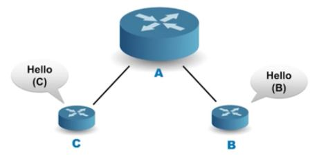
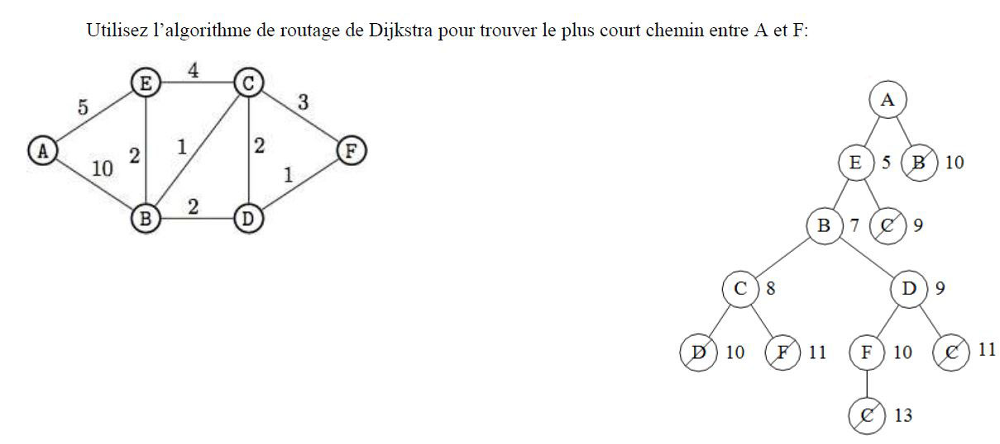
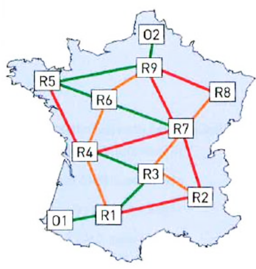
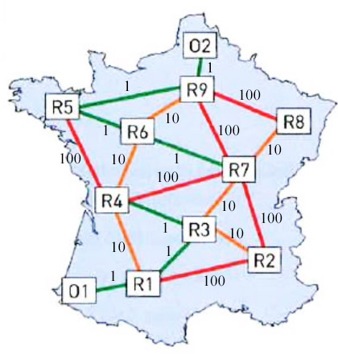
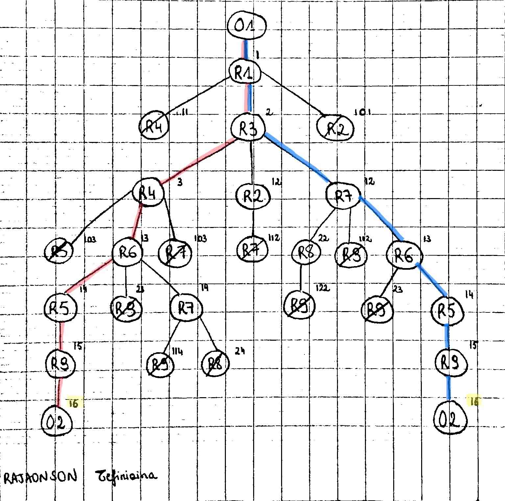
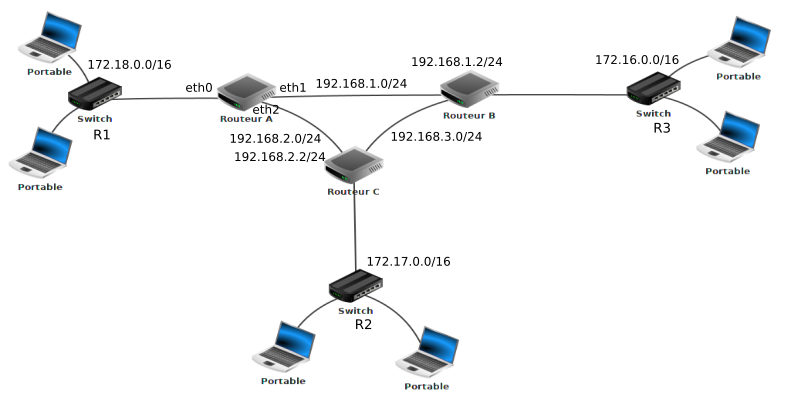
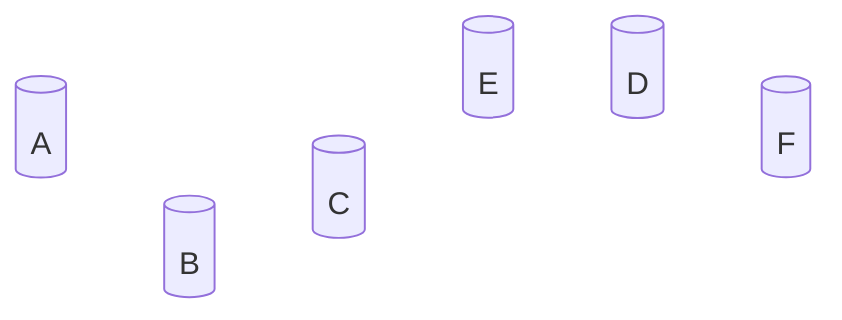

## I. Protocole OSPF à état de lien

!!! info "OSPF"

    OSPF :  **O**pen **S**hortest **P**ath **F**irst

!!! warning "Justification"

	Le protocole RIP est basé sur un nombre de sauts. Or, les connexions entre routeurs sont de nature variées : fibre, câble Ethernet, WiFi... avec des performances tout aussi variées. Le plus court chemin d'un routeur à un autre n'est donc pas forcément celui qui présente le plus petit nombre de sauts. De plus nous avons vu que RIP n'est pas adapté aux grands réseaux (limitation à 15 sauts).

???+ note dépliée

	Dans les années 90, la taille des réseaux augmentant, les ingénieurs de l'organisme de normalisation international (IETF :  Internet Engineering Task Force)
	ont développé un nouveau protocole : <b>OSPF</b>. Ce protocole prend en compte la bande passante des connexions dans
	le réseau.

!!! info "protocoles à état de lien"

	Le protocole **OSPF** (Open Shortest Path First) rentre dans la catégorie des protocoles **à état de lien**.

	Dans le protocole à vecteur de distance que nous venons de voir, on cherche à minimiser le nombre de sauts,
	mais sans aucune garantie que le chemin emprunté soit en réalité le plus performant (en termes de débit par exemple).
	De plus avec RIP, chaque routeur ne connaît que ses voisins immédiats, il n'a donc pas connaissance de l'ensemble de la topologie du réseau.
	Enfin, le protocole RIP est limité aux petits réseaux (15 sauts maximum) et est assez gourmand en terme de bande passante
	puisqu'il nécessite l'échange d'un volume de données assez important.

## II. Principe général de l'algorithme

!!! info 

	Le protocole OSPF propose une approche tout à fait différente : au lieu de s'intéresser au nombre de sauts, on va chercher à optimiser en fonction du débit des liaisons empruntées.

	Pour cela, chaque routeur va devoir connaître <strong>l'intégralité du réseau</strong> avec le <strong>débit associé à chaque lien</strong> afin d'appliquer un algorithme de recherche de chemin optimal.

!!! info 

	On peut faire un parallèle entre le fonctionnement d'OSPF et celui de nos logiciels de guidage par GPS. En effet, dans ce type de logiciels :
	<ul>
	<li>l'ensemble de la carte de France et de ses routes est connue du logiciel</li>
	<li>le type de chaque route est renseigné ainsi que la vitesse autorisée sur la route</li>
	<li>le calcul d'itinéraire va permettre le calcul d'un chemin permettant par exemple d'emprunter les routes sur lesquelles la vitesse est la plus importante (temps le plus court).</li>
	</ul>


<p>Cette vidéo de Claude Chaudet (Institut Mines-Télécom)  expose le principe du routage à état de lien.</p>
<iframe width="560" height="315" src="https://www.youtube.com/embed/-utHPKREZV8" frameborder="0" allow="accelerometer; autoplay; encrypted-media; gyroscope; picture-in-picture" allowfullscreen></iframe>

<br>
<p>Cette autre vidéo de Claude Chaudet (Institut Mines-Télécom)  expose le principe du protocole OSPF.</p>
<a target="wims_external" href="https://www.youtube.com/watch?v=FeZI3Xl7j84&list=PLjXls-kqM6JDyMO3Llm5olS_U2I_P6OHG&index=6">&#127760;  Principe du protocole OSPF</a>

## III. Découverte de la topologie du réseau

OSPF a besoin de connaître la topologie du réseau ainsi que la qualité de chaque lien en terme de bande passante.  
Pour cela, chaque routeur va fabriquer une **table de voisinage** : il s'agit d'un tableau permettant d'identifier tous les routeurs qui lui sont connectés ainsi que le débit associé à chaque lien.  
Pour obtenir ces informations, le routeur échange périodiquement des messages (appelés messages **hello**) avec ses voisins.  
{ width=35% .center}

<table width = 60%>
<th>Voisin </th><th> qualité du lien </th>
<tr><td> B </td><td>  1 Gb/s  </td></tr>
<tr><td> C </td><td>  10 Gb/s </td></tr>
</table>

Une fois tous ses voisins directs identifiés, le routeur va envoyer sa table de voisinage à **tous les autres routeurs** du réseau.   
Il va recevoir des autres routeurs leurs tables de voisinages et ainsi pouvoir constituer une **cartographie complète** du réseau.

!!! info "Coût"

	Le coût est lié au débit de la liaison entre les routeurs, il est inversement proportionnel au débit et souvent donné par la relation : $\text{coût}=\dfrac{10^8}{\text{débit}}$ où $10^8$ est la valeur de référence correspondant au débit maximum de 100 Mbps et où le débit est exprimé en bits par secondes.

	👉 Actuellement les liaisons FTTH ont un débit maximum de 10 Gbps. La valeur de référence peut donc être égale à 10 Gbps ($10^{10}$ bps). Le coût peut donc être donné par : $\text{coût}=\dfrac{10^{10}}{\text{débit}}$ où le débit est exprimé en bits par secondes.

	Si la route possède plusieurs liaisons, le coût total de la route est la somme des coûts des liaisons.

	👉 Avec le protocole  OSPF **les coûts inférieurs à 1 sont ramenés à 1**.

	👉 Dans la pratique, se conformer à l'énoncé du sujet ...


!!! info "Unités utilisées"

	1 Mb/s = $10^6$ b/s  (1 méga)

	1 Gb/s = $10^9$ b/s (1 giga)


Exemples de débits  


| Technologie  | Bande passante descendante | Bande passante montante |
| :---:    | :----:    | :---:   |
| Modem   | 56 kbps | 48 kbps |
| Bluetooth    | 3 Mbps | 3 Mbps |
| Ethernet    | 10 Mbps | 10 Mbps |
| WiFi    | 11 Mbps | 10 Mbps |
| ADSL    | 13 Mbps | 1 Mbps |
| 4G    | 100 Mbps | 50 Mbps |
| Satellite   | 50 Mbps | 1 Mbps |
| Fast Ethernet   | 100 Mbps | 100 Mbps |
| 5G   | 1 Gbps | 300 Mbps |
| FTTH (fibre)   | 10 Gbps | 10 Gbps |

!!! info "Ecritures des unités utilisées"

	&#128073; L'unité utilisée pour le débit est le **bit par seconde**.  

	Vous rencontrerez trois écritures différentes qui signifient la même chose : 
	<ul>
	<li>b/s </li>
	<li> $\text{b}.\text{s}^{-1}$</li>
	<li> bps</li>
	</ul>

??? question "QCM puissances - 1"

    $10^0=$

    === "Cocher la ou les affirmations correctes"
        
        - [ ] 0
        - [ ] 1
        - [ ] 10
        - [ ] Autre réponse

    === "Solution"
        
        - :x: 
        - :white_check_mark: A savoir : $a^0=1$
        - :x: 
        - :x: 

??? question "QCM puissances - 2"

    $\dfrac{10^8}{10^6}=$

    === "Cocher la ou les affirmations correctes"
        
        - [ ] 2
        - [ ] 100
        - [ ] 0.01
        - [ ] Autre réponse

    === "Solution"
        
        - :x: 
        - :white_check_mark: $\dfrac{10^8}{10^6}=10^{8-6}=10^{2}=100$
        - :x: 
        - :x: 

??? question "QCM puissances - 3"

    $\dfrac{10^6}{10^8}=$

    === "Cocher la ou les affirmations correctes"
        
        - [ ] 2
        - [ ] 100
        - [ ] 0.01
        - [ ] Autre réponse

    === "Solution"
        
        - :x: 
        - :x:
        - :white_check_mark: $\dfrac{10^6}{10^8}=10^{6-8}=10^{-2}=\dfrac{1}{10^2}=\dfrac{1}{100}=0.01$
        - :x: 

??? question "QCM puissances - 4"

    $\dfrac{10^8}{50 \times 10^6}=$

    === "Cocher la ou les affirmations correctes"
        
        - [ ] 2
        - [ ] 0.2
        - [ ] 20
        - [ ] Autre réponse

    === "Solution"
        
        - :white_check_mark: $\dfrac{10^8}{50 \times 10^6}=\dfrac{10^2 \times 10^{6}}{50 \times 10^6}=\dfrac{100 \times 10^{6}}{50 \times 10^6}= 2$
        - :x:
        - :x:
        - :x: 

??? question "Unités"

	Donner en bps ($\text{b.s}^{-1}$)

	a) 2 kbps

	b) 50 kbps

	c) 3 Mbps

	d) 50 Mbps

	e) 100 Mbps

	f) 1 Gbps

	g) 10 Gbps

	??? success "Solution"

		a) 2 kbps = $2 \times 10^3$ bps = 2000 bps = 2000 b/s = 2000 $\text{b.s}^{-1}$

		b) 50 kbps = $50 \times 10^3$ bps = 50000 bps = $5 \times 10^4$ bps  = $5 \times 10^4$  $\text{b.s}^{-1}$

		c) 3 Mbps =  $3 \times 10^6$ bps = $3 \times 10^6$ b/s = $3 \times 10^6$  $\text{b.s}^{-1}$

		d) 50 Mbps = $50 \times 10^6$ bps = $50 \times 10^6$ b/s =  $5 \times 10^7$ b/s = $5 \times 10^7$   $\text{b.s}^{-1}$

		e) 100 Mbps = $100 \times 10^6$ bps = $10^2 \times 10^6$ bps = $10^8$ bps = $10^8$ b/s = $10^8$   $\text{b.s}^{-1}$

		f) 1 Gbps = $10^9$ bps = $10^9$ b/s = $10^9$   $\text{b.s}^{-1}$

		g) 10 Gbps = $10 \times 10^{9}$ bps = $10^{10}$ b/s = $10^{10}$   $\text{b.s}^{-1}$


??? question "Exercice 1"

    a) Calculer la métrique OSPF d'une liaison Fibre avec une valeur de référence de $10^8$ bps 

	b) Même question avec une valeur de référence de $10^{10}$ bps

    ??? success "Solution"

		a) $\dfrac{10^8}{10^{10}}=10^{8-10}=10^{-2}=0.01$

		b) $\dfrac{10^{10}}{10^{10}}=1$

??? question "Exercice 2"

    a) Calculer la métrique OSPF d'une liaison FastEthernet avec une valeur de référence de $10^8$ bps 

	b) Même question avec une valeur de référence de $10^{10}$ bps

    ??? success "Solution"

		100 Mbps = $100 \times 10^6=10^2 \times 10^6=10^8$ bps

		a) $\dfrac{10^8}{10^8}=10^{8-8}=10^0=1$

		b) $\dfrac{10^{10}}{10^8}=10^{10-8}=10^{2}=100$

??? question "Exercice 3"

    a) Calculer la métrique OSPF d'une liaison Ethernet (débit 10 Mbps) avec une valeur de référence de $10^8$ bps 

	b) Même question avec une valeur de référence de $10^{10}$ bps

    ??? success "Solution"

		10 Mbps = $10 \times 10^6=10 \times 10^6=10^7$ bps

		a) $\dfrac{10^8}{10^7}=10^{8-7}=10^1=10$

		b) $\dfrac{10^{10}}{10^7}=10^{10-7}=10^{3}=1000$

??? question "Exercice 4"

    Que vaut la bande passante d'une liaison dont le coût OSPF est de 50 avec une valeur de référence de $10^8$.

    ??? success "Solution"

		$50 = \dfrac{10^8}{x} \Leftrightarrow 50x=10^8 \Leftrightarrow x= \dfrac{10^8}{50} = \dfrac{100 \times 10^6}{50} = 2 \times 10^6$

		La bande passante est de 2 Mbps

## IV. Exemple

Considérons le réseau suivant. Après échanges de messages **hello**, la cartographie suivante du réseau a été constituée :

{ width=50% .center}

Source : Gilles LASSUS


* 25 Mb/s a un coût de $\dfrac{10^8}{25 \times 10^6} = 4$. 
* 20 Mb/s a un coût de $\dfrac{10^8}{20 \times 10^6} = 5$.
* 50 Mb/s a un coût de $\dfrac{10^8}{50 \times 10^6 }=2$. 
* 10 Mb/s a un coût de $\dfrac{10^8}{10 \times 10^6 }=10$. 

On obtient donc le réseau suivant, où on a noté les coûts sur les arêtes : 


{ width=50% .center}

 Source : Gilles LASSUS
 
&#127797; 
Le chemin le plus rapide pour aller de l'ordinateur au serveur est donc R1-R2-R4, et non plus R1-R3 comme l'aurait indiqué le protocole RIP.

## V. Trouver le plus court chemin dans un graphe pondéré

L'exemple précédent était très simple et de solution intuitive. 

Pour les cas complexes, on peut utiliser l'algorithme de Dijkstra.

La maîtrise de cet algorithme n'est pas au programme de NSI. Si néanmoins cela vous intéresse, vous pouvez regarder cette vidéo :

<center>
<iframe width="635" height="357" src="https://www.youtube.com/embed/rI-Rc7eF4iw"  frameborder="0" allow="accelerometer; autoplay; encrypted-media; gyroscope; picture-in-picture" allowfullscreen></iframe>
</center>

&#128161; Une autre méthode pour justifier du choix d'un chemin par l'algorithme de Dijkstra est de réaliser un arbre sur lequel on barre les feuilles au fur et à mesure.

{ width=80% .center}

<p><br><b>&#127797; Comment a-t-on réalisé cet arbre ?</b>
<br>&#128073; Un peu comme nous l'avons fait dans le parcours de labyrinthes, nous élaborons au fur et à mesure un arbre avec les choix possibles. 
<br>&#128514; Evidemment, on ne revient jamais en arrière, car cela ne ferait qu'augmenter les coûts.<br>
<ul>
 <li>En partant de A, nous avons deux possibilités : E avec un coût de 5 et B avec un coût de 10</li>
<li>En partant de E, nous avons deux possibilités : B avec un coût de 7 et C avec un coût de 9
<br>7 < 10 donc on barre le B avec un coût de 10</li>
<li>En partant de B, nous avons deux possibilités : C avec un coût de 8 et D avec un coût de 9
<br>8 < 9 donc on barre le C avec un coût de 9</li>
<li>En partant de C, nous avons deux possibilités : D avec un coût de 10 et F avec un coût de 11
<br> 9 < 10 donc on barre le D avec un coût de 10</li>
<li>En partant de D, nous avons deux possibilités : F avec un coût de 10 et C avec un coût de 11
<br>8 < 11 donc on barre le C avec un coût de 11
<br>10 < 11 donc on barre le F avec un coût de 11</li>
<li>En partant de F, nous avons une seule possibilité : C avec un coût de 13 
<br>8 < 11 donc on barre le C avec un coût de 13</li>
</ul>
.<br>&#128522; Il n'y a plus qu'à lire le chemin non barré dans l'arbre, qui part de A et arrive en F
<br>&#128512; On obtient donc comme plus court chemin entre A et F : A - E - B - D - F avec un coût total de 10
</p>

## VI. Conclusion

???+ note dépliée "S'adapter ?"

	OSPF peut s'adapter à la qualité des liens mais dans une certaine mesure uniquement : Si un lien à 10 Gb/s est saturé, il vaut mieux emprunter un lien à 
	1 Gb/s sous utilisé, mais OSPF n'en a pas connaissance.

???+ note dépliée "Meilleur routage ?"

	Il n'y a pas dans l'absolu de meilleur algorithme de routage, tout dépend du réseau auquel on a affaire. Un protocole
	sera plus réactif face aux changements de topologie mais au prix d'un plus gros volume échangé. Un autre sera plus
	efficace si les liaisons au sein du réseau sont très hétérogènes.

!!! info "Unix"

	Sous Unix, les commandes `route` ou `iproute` permettent d’afficher la table de routage d’une
	machine. La commande `traceroute`  permet d’obtenir la liste des machines reliant la machine
	locale à une destination.

## VII. Exercices

### Exercice 1

???+ question "Exercice de recherche de plus court chemin"
    
    Donner le plus court chemin pour aller de E à F dans le graphe ci-dessous :

    {: .center width=60%}

    ??? success "Solution"

        Avec un arbre par exemple, on voit que le meilleur trajet est  E-D-A-C-B-F.

### Exercice 2

Le client 01 veut communiquer avec le serveur 02.

{ width=40% .center}

<ul>
 <li>Les liens en vert sont en FastEthernet (100 mbps)</li>
 <li>Les lien oranges en Ethernet (10 mbps)</li>
 <li>Les liens rouges sont en 1 mbps</li>
</ul>

<ol>
 <li>Faire un graphe de cette situation, avec les coûts sur les arêtes</li>
<li>Donner le chemin le plus court avec le protocole OSPF entre 01 et 02. Quelle est la longueur de ce chemin ?
Y'a-t-il plusieurs chemins équivalents ?</li>
</ol>
</p>

??? success "Solution"

	$\dfrac{10^8}{100 \times 10^6}=1$

	$\dfrac{10^8}{10 \times 10^6}=10$

	$\dfrac{10^8}{ 10^6}=100$

	On obtient donc :

	{ width=50% .center}

	En réalisant un arbre, ou le tableau de l'algorithme de Dijkstra, on obtient deux chemins équivalents de coût total 16 : 

	{ width=80% .center}

	* O1 - R1 - R3 - R7 - R6 - R5 - R9 - O2 
	* O1 - R1 - R3 - R4 - R6 - R5 - R9 - O2


### Exercice 3 

<p>On donne le réseau suivant (source : David Roche)</p>

{ width=100% .center}

1. En vous basant sur le protocole OSPF (vous mettrez en dernière colonne "métrique", ce qui correspond au coût total pour arriver à destination), déterminez la table de routage du routeur A

On donne les débits suivants :

<ul>
<li>liaison routeur A - routeur B : **1 Mbps**</li>
<li>liaison routeur A - routeur C : **10 Mbps**</li>
<li>liaison routeur C - routeur B : **10 Mbps**</li>
<li>liaisons dans le réseau 172.16.0.0/16 : **1 Mbps**</li>
<li>liaisons dans le réseau 172.18.0.0/16 : **1 Mbps**</li>
<li>liaisons dans le réseau 172.17.0.0/16 : **1 Mbps**</li>
</ul>

??? success "Solution"
 
	Commençons par calculer les coûts des liaisons

	<ul>
	<li>liaison routeur A - routeur B : 10<sup>8</sup>/10<sup>6</sup> = 100</li>
	<li>liaison routeur A - routeur C : 10<sup>8</sup>/10<sup>7</sup> = 10</li>
	<li>liaison routeur C - routeur B : 10<sup>8</sup>/10<sup>7</sup> = 10</li>
	<li>liaisons dans les réseaux 172.16.0.0/13 et 172.18.0.0/16 et 172.17.0.0/16 : 10<sup>8</sup>/10<sup>6</sup> = 100</li>
	</ul>

	On obtient donc la table de routage suivante pour le <b>routeur A:</b>
	<table>
	<thead>
	<tr>
	<th>destination</th>
	<th>passerelle</th>
	<th>interface</th>
	<th>métrique</th>
	</tr>
	</thead>
	<tbody><tr>
	<td>172.18.0.0/16</td>
	<td></td>	
	<td>eth0</td>
	<td>100 </td>
	</tr>
	<tr>
	<td>192.168.1.0/24</td>
	<td></td>	
	<td>eth1</td>
	<td>100 </td>
	</tr>
	<tr>
	<td>192.168.2.0/24</td>
	<td></td>	
	<td>eth2</td>
	<td>10 </td>
	</tr>
	<tr>
	<td>172.17.0.0/16</td>
	<td>192.168.2.2/24</td>
	<td>eth2</td>	
	<td>110 </td>
	</tr>
	<tr>
	<td>192.168.3.0/24</td>
	<td>192.168.2.2/24</td>
	<td>eth2</td>	
	<td>20</td>
	</tr>
	<tr>
	<td>172.16.0.0/16</td>
	<td>192.168.2.2/24</td>
	<td>eth2</td>
	<td>120 </td>
	</tr>
	</tbody></table>
	

2.Quels sont les chemins qui seraient empruntés par un paquet pour aller du switch R1 au switch R2 et du switch R1 au switch R3 ?

 
??? success "Solution"

	* Pour un paquet de données allant du switch R1 au switch R2 :   
	la route privilégiée sera donc : R1 -> Routeur A -> Routeur C -> R2.  
	
	* Pour un paquet de données allant du switch R1 au  switch R3 :   
	la route privilégiée sera donc : R1 -> Routeur A -> Routeur C -> Routeur B -> R3.

### Exercice 4 : 

> D'après 2022, Métropole, J2, Ex. 3

**Rappels :**

Une adresse IPv4 est composée de 4 octets, soit 32 bits. Elle est notée `a.b.c.d`, où `a`, `b`, `c` et `d` sont les valeurs des 4 octets.

La notation `a.b.c.d/n` signifie que les `n` premiers bits de l'adresse IP représentent la partie « réseau », les bits qui suivent représentent la partie « machine ».

L'adresse IPv4 dont tous les bits de la partie « machine » sont à 0 est appelée « adresse du réseau ».

L'adresse IPv4 dont tous les bits de la partie « machine » sont à 1 est appelée « adresse de diffusion ».

On considère le réseau représenté sur la ci-dessous :

{width=95%}
{width=95%}

**1.** On considère la machine d'adresse IPv4 `192.168.1.1`.

**1.a.** Donner l'adresse du réseau sur lequel se trouve cette machine.

??? success "Réponse"

    On lit sur la figure la dénomination suivante : `192.168.1.0/24`. Les 24 premiers bits, trois octets, représentent l'adresse réseau : celle-ci est donc `192.168.1.0`.

**1.b.** Donner l'adresse de diffusion (broadcast) de ce réseau.

??? success "Réponse"

    Les 8 derniers bits, le dernier octet, prennent la valeur `1`. Donc l'adresse de diffusion est `192.168.1.255`.

**1.c.** Donner le nombre maximal de machines que l'on peut connecter sur ce réseau.

??? success "Réponse"

    On peut connecter 256 - 2 = 254 machines sur ce réseau.

**1.d.** On souhaite ajouter une machine sur ce réseau, proposer une adresse IPv4 possible pour cette machine.

??? success "Réponse"

    On propose `192.168.1.17`.

**2.** La machine d'adresse IPv4 `192.168.1.1` transmet un paquet IPv4 à la machine d'adresse IPv4 `192.168.4.2`.

**2.a.**  Donner toutes les routes pouvant être empruntées par ce paquet IPv4, chaque routeur ne pouvant être traversé qu'une seule fois.

??? success "Réponse"

    Les routes possibles sont :

    * A → E → D
    * A → E → C → F → D
    * A → B → C → E → D
    * A → B → C → F → D
    * A → C → E → D
    * A → C → F → D

**2.b.** Expliquer l'utilité d'avoir plusieurs routes possibles reliant les réseaux `192.168.1.0/24` et `192.168.4.0/24`.

??? success "Réponse"

    En cas de panne, on pourra utiliser une autre route.

**3.** Dans cette question, on suppose que le protocole de routage mis en place dans le réseau est RIP. Ce protocole consiste à minimiser le nombre de sauts.

Le schéma du réseau est celui de la figure ci-dessus.

Les tables de routage utilisées sont données ci-dessous :

=== "Routeur A"

    | Destination | passe par |
    | :---------: | :-------: |
    |      B      |    ...    |
    |      C      |    ...    |
    |      D      |     E     |
    |      E      |    ...    |
    |      F      |     C     |

=== "Routeur B"

    | Destination | passe par |
    | :---------: | :-------: |
    |      A      |     A     |
    |      C      |     C     |
    |      D      |     C     |
    |      E      |     C     |
    |      F      |     C     |

=== "Routeur C"

    | Destination | passe par |
    | :---------: | :-------: |
    |      A      |     A     |
    |      B      |     B     |
    |      D      |     E     |
    |      E      |     E     |
    |      F      |     F     |

=== "Routeur D"

    | Destination | passe par |
    | :---------: | :-------: |
    |      A      |     E     |
    |      B      |     F     |
    |      C      |     F     |
    |      E      |     E     |
    |      F      |     F     |

=== "Routeur E"

    | Destination | passe par |
    | :---------: | :-------: |
    |      A      |     A     |
    |      B      |     C     |
    |      C      |     C     |
    |      D      |     D     |
    |      F      |     C     |

=== "Routeur F"

    | Destination | passe par |
    | :---------: | :-------: |
    |      A      |     C     |
    |      B      |     C     |
    |      C      |     C     |
    |      D      |     D     |
    |      E      |     C     |

**3.a.** Recopier et compléter sur la copie la table de routage du routeur A.

??? success "Réponse"

    Table de routage de A :
    
    | Destination | Passe par |
    | :---------: | :-------: |
    |      B      |     B     |
    |      C      |     C     |
    |      D      |     E     |
    |      E      |     E     |
    |      F      |     C     |

**3.b.** Un paquet IP doit aller du routeur B au routeur D. En utilisant les tables de routage, donner le parcours emprunté par celui-ci.

??? success "Réponse"

    Le paquet suit le trajet suivant :

    * B → C (table de routage de B)
    * C → E (table de routage de C)
    * E → D (table de routage de E)

**3.c.** Les connexions entre les routeurs B-C et A-E étant coupées, sur la copie, réécrire les tables de routage des routeurs A, B et C.

??? success "Réponse"

    === "Routeur A"

        | Destination | Passe par |
        | :---------: | :-------: |
        |      B      |     B     |
        |      C      |     C     |
        |      D      |     C     |
        |      E      |     C     |
        |      F      |     C     |

    === "Routeur B"

        | Destination | Passe par |
        | :---------: | :-------: |
        |      A      |     A     |
        |      C      |     A     |
        |      D      |     A     |
        |      E      |     A     |
        |      F      |     A     |

    === "Routeur C"

        | Destination | Passe par |
        | :---------: | :-------: |
        |      A      |     A     |
        |      B      |     A     |
        |      D      |     E     |
        |      E      |     E     |
        |      F      |     F     |

**3.d.** Déterminer le nouveau parcours emprunté par le paquet IP pour aller du routeur B au routeur D.

??? success "Réponse"

    Le nouveau parcours est : B → A → C → E → D.

**4.** Dans cette question, on suppose que le protocole de routage mis en place dans le réseau est OSPF. Ce protocole consiste à minimiser la somme des coûts des liaisons empruntées.

Le coût d'une liaison est défini par la relation $\mathrm{coût} = \frac{10^8}{d}$ où $d$ représente le débit en $\mathrm{bit}/\mathrm{s}$ et $\mathrm{coût}$ est sans unité. Le schéma du réseau reste celui du début de l'exercice.

**4.a.** Déterminer le coût des liaisons Ethernet ($d = 10^7\,\mathrm{bit}/\mathrm{s}$), Fast-Ethernet ($d = 10^8\,\mathrm{bit}/\mathrm{s}$) et Fibre ($d = 10^9\,\mathrm{bit}/\mathrm{s}$).

??? success "Réponse"

    Les coûts sont les suivants :

    * liaison Ethernet : $\frac{10^8}{10^7}=10$,
    * liaison Fast-Ethernet : $\frac{10^8}{10^8}=1$,
    * liaison Fibre : $\frac{10^8}{10^9}=0,1$

    !!! warning "Attention"
    
        Dans le protocole OSPF, les coûts sont normalement des nombres entiers strictement positifs (entre $1$ et $65\,535$). On peut donc aussi arrondir par excès le coût de la liaison Fibre à $1$.

**4.b.** On veut représenter schématiquement le réseau de routeurs à partir du schéma du réseau.

Recopier sur la copie le schéma ci-dessous et tracer les liaisons entre les routeurs en y indiquant leur coût.



??? success "Réponse"

    === "Sans arrondi"

        On conserve ici la valeur de $0,1$ pour le coût de la liaison Fibre.

        ```mermaid
        graph LR
            A[(A)] --- |1| B[(B)]
            A --- |0,1| C[(C)]
            A --- |1| E[(E)]
            B --- |10| C
            C --- |0,1| E
            E --- |0,1| D[(D)]
            D --- |0,1| F[(F)]
            C --- |1| F
        ```
    
    === "Avec arrondi"

        On arrondit le coût de la liaison Fibre à $1$.

        ```mermaid
        graph LR
            A[(A)] --- |1| B[(B)]
            A --- |1| C[(C)]
            A --- |1| E[(E)]
            B --- |10| C
            C --- |1| E
            E --- |1| D[(D)]
            D --- |1| F[(F)]
            C --- |1| F
        ```

**4.c.** Un paquet IPv4 doit être acheminé d'une machine ayant pour adresse IPv4 `192.168.2.1` à une machine ayant pour adresse IPv4 `192.168.4.1`.

Écrire les routes possibles, c'est à dire la liste des routeurs traversés, et le coût de chacune de ces routes, chaque routeur ne pouvant être traversé qu'une
seule fois.

??? success "Réponse"

    === "Sans arrondi"

        On conserve la valeur de $0,1$ pour le coût de la liaison Fibre. On aura donc :

        | Route                      | Coût |
        | :------------------------- | :--- |
        | B → A → E → D              | 2,1  |
        | B → C → A → E → D          | 11,2 |
        | B →  A →  C →  F →  D      | 2,2  |
        | B →  A →  C →  E →  D      | 1,3  |
        | B →  A →  E →  C →  F →  D | 3,2  |
        | B →  C →  F →  D           | 11,1 |
        | B →  C →  E →  D           | 10,2 |
    
    
    === "Sans arrondi"

        On arrondit le coût de la liaison Fibre à $1$. On aura donc :

        | Route                      | Coût |
        | :------------------------- | :--- |
        | B → A → E → D              | 3    |
        | B → C → A → E → D          | 13   |
        | B →  A →  C →  F →  D      | 4    |
        | B →  A →  C →  E →  D      | 4    |
        | B →  A →  E →  C →  F →  D | 5    |
        | B →  C →  F →  D           | 12   |
        | B →  C →  E →  D           | 12   |

**4.d.** Donner, en la justifiant, la route qui sera empruntée par un paquet IPv4 pour aller d'une machine ayant pour adresse IPv4 `192.168.2.1` à une machine ayant pour adresse IPv4 `192.168.4.1`.

??? success "Réponse"

    On choisit le chemin de coût minimal :
    
    * si l'on a conservé un coût de $0,1$ pour la liaison Fibre, on obtient le chemin B → A → C → E → D pour un coût de $1,3$ ;
    * si l'on arrondit ce coût à $1$, on obtient le chemin B → A → E → D pour un coût de $3$.
	
