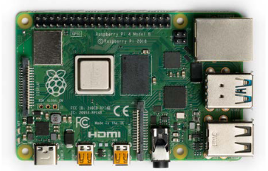
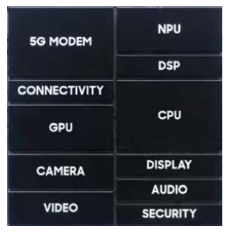
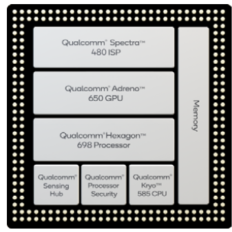

??? quote Ressources
    - [nsi4noobs](http://nsi4noobs.fr/IMG/pdf/c1_tnsi_soc.pdf)
    - [glassus.github.io](https://glassus.github.io/terminale_nsi/T5_Architecture_materielle/5.1_Systemes_sur_puce/cours/)
    - [tnsi.free.fr](http://tnsi.free.fr/documents/11.%20SoCs.pdf)
    - [Principe d'un transistor](https://www.irif.fr/~carton/Enseignement/Architecture/Cours/Gates/)

# Cours - Composants intégrés d’un SoC

L'avancée dans la miniaturisation des composants des circuits électroniques a donné naissance aux **systèmes sur puce** (*SoC* pour *'System on a Chip'* en anglais), qui intègrent dans un seul circuit de **nombreuses fonctions** qui étaient auparavant réalisées par des **circuits distincts** assemblés sur une carte électronique. Ces **SoC** sont conçus et développés de manière logicielle, avec leurs composants électroniques accessibles via des API, à l'instar des bibliothèques logicielles.

## La Loi de Moore

En 1965, Gordon Moore postule que le **nombre de transistors** présents sur une puce de microprocesseur **doublera tous les deux ans**.

{ width="200px" }

Cette prédiction s'est révélée étonnamment juste (à quelques approximations près) et les équipements électroniques n'ont depuis jamais cessé de devenir toujours plus performants / miniatures / économes en énergie.

## Historique : la course à la miniaturisation

- **1946** : L'armée américaine invente l'**ENIAC**, le **tout premier ordinateur** entièrement **électronique**, dans le but de calculer les trajectoires d'artillerie. Pesant 30 tonnes et aussi grand qu'une grande pièce, il était équipé de **19 000 lampes à vide**.
- **1947** : Les Américains John Bardeen, William Shockley et Walter Brattain inventent le **premier transistor** dans les laboratoires Bell, ce qui leur vaudra le prix Nobel de physique en 1956. Ce dispositif est **dix fois plus petit que les lampes à vide**.
- **1954** : Les laboratoires **Bell** fabriquent le **premier ordinateur utilisant des transistors**, le **TRADIC Phase One**.
- **1957** : **IBM** commercialise la **première calculatrice à transistors**, l'**IBM 608**, une unité programmable sur tableau de connexion, qui serait la première calculatrice entièrement transistorisée au monde à être fabriquée pour le marché commercial, équipée de **3 000 transistors**.
- **1958** : Jack St. Clair Kilby de Texas Instruments développe le **premier circuit intégré** en plaçant **transistors**, **résistances** et **capacités** sur une **plaque de germanium semi-conductrice**. Il sera également à l'origine de la calculatrice de poche **Texas Instruments**, commercialisée en **1972**.
- **1959** : L'**IBM 7090**, **ordinateur à base de transistor**, est **commercialisé**. La série des IBM 700s qui utilisaient des composantes électroniques basées sur des tubes électroniques ont été remplacés par les IBM 7000s qui utilisent des transistors. 
- **1965** : **Gordon Moore**, cofondateur d'**Intel**, énonce sa célèbre **loi de Moore**, prédissant que le nombre de **transistors** pouvant être intégrés sur une carte de silicium **doublera tous les deux ans**. Cette prédiction devient une directive clé pour **Intel** et d'autres fabricants de puces électroniques.
- **1966** : L'**Appolo Guidance Computer**, le **premier ordinateur à circuit intégré** en **silicium**, est développé. Chaque vol vers la Lune est équipé de deux de ces ordinateurs, qui fonctionnaient à une vitesse d'horloge de 1 Mhz (1 million de cycles par seconde) et disposaient d'une mémoire morte (ROM) de 72 ko pour les programmes, ainsi que d'une mémoire vive (RAM) de 4 ko.  
En **1969**, dans l'usine IBM de Corbeil-Essonnes, le directeur technique montre les différentes étapes de **miniaturisation des composants** de l'ordinateur franchies en **dix ans**, avec l'utilisation du **transistor** et du **circuit intégré**. [Voir la vidéo](https://enseignants.lumni.fr/fiche-media/00000000640/les-transistors-et-la-miniaturisation-de-l-ordinateur.htm).
- En **1971**, le **premier microprocesseur commercialisé**, l'**Intel 4004**, voit le jour. Ce **processeur 4 bits** marque la **première intégration réussie** de **toutes les fonctions d'un processeur** sur **un seul circuit intégré**. Bien que moins performant que les ordinateurs contemporains, il ouvre la voie à la création d'ordinateurs **beaucoup moins coûteux**, inaugurant ainsi l'ère des **ordinateurs personnels**.

La **prédiction de Moore**, véritable prophétie autoréalisatrice, s'est avérée exacte jusqu'à aujourd'hui.  
En **1971**, l'**Intel 4004** comptait **2 250 transistors**.  
En **2019**, l'**AMD Epyc Rome** en contient **39 540 000 000**, soit environ **39 milliards**. En effet, $2 250$ multiplié par $2^{24}$ donne environ **38 milliards** (24 doublements en 48 ans), respectant ainsi la **loi de Moore**.

En **2020**, seuls **Samsung** et **TSMC** produisent des transistors de **5 nm** (nanomètres).  
**TSMC** (Taiwan Semiconductor Manufacturing Company) fabrique des puces pour Apple, AMD, Nvidia (cartes graphiques) et **Qualcomm** (notamment pour les **SoCs Snapdragon** équipant de nombreux smartphones).  
**Intel** prévoit de lancer des processeurs en **5 nm** pour **2023**, tandis que **TSMC** travaille déjà sur des processus de fabrication en **3 nm** et **2 nm**, offrant un avantage concurrentiel significatif à **AMD**.

!!! question "La fin de la loi de Moore ?"
    Un **transistor**, plus précisément un **MOSFET** (*metal–oxide–semiconductor field-effect transistor*) de **2 nm** fait **dix fois la taille d’un atome de silicium**. **Intel** envisage le **1.4 nm** pour **2029** mais on atteint les limites du possible.

    Les chercheurs se tournent vers deux nouvelles pistes :

    - les puces neuromorphiques simulent les neurones des cerveaux des êtres vivants
    - les puces quantiques remplacent le bit (2 valeurs possibles) par le qubit qui prend simultanément
    une infinité d’états possibles.

## Le rôle des transistors

!!! abstract ""
    Le transistor est un **composant électronique** essentiel : il permet de **laisser (ou non) passer un courant électrique**.

    

    { width="300px" }
    

Ainsi que l'avait prédit **Moore**, c'est la **progression du nombre de transistors** gravables sur le **processeur** qui guidera pendant des années l'évolution de l'informatique :

## Exemples de SoC

### Raspberry Pi

Le **Raspberry Pi** est un **nano-ordinateur** de la taille d'une carte de crédit, conçu à l'université de Cambridge. Il peut être acheté à nu pour quelques dizaines d'euros. Le **SoC** (System on a Chip) est la **pièce argentée** située au **centre de la carte**. Le **Raspberry Pi 4** est équipé du **SoC Broadcom BCM2711**, qui intègre un **CPU ARM Cortex-A72** (un **processeur quad-core** à **1,5 GHz**), un **GPU** (processeur graphique), ainsi que les circuits nécessaires à la gestion de la mémoire (MMU), de l'Ethernet, et autres fonctionnalités.

La **mémoire** du **Raspberry Pi** n'est **pas incluse dans le SoC** ; il faut y insérer une **carte micro SD** pour y stocker son système d'exploitation, et éventuellement une **clé USB** pour utiliser d'autres données.

<figure markdown="span">
  { width="300" }
  <figcaption>Image caption</figcaption>
</figure>

### Smartphones

Les **SoC** des **smartphones** regroupent divers **circuits**, principalement : 

- Microprocesseur principal : **CPU**
- Microprocesseur graphique : **GPU**
- Microprocesseurs spécialisés dans le traitement d'image (**ISP**, Image Signal Processing) et dans l'encodage/décodage multimédia (**DSP**, Digital Signal Processor)
- **Mémoire**
- **Contrôleurs** pour la gestion des composants du smartphone : appareil photo, GPS, connexions (4G, 5G, WiFi, Bluetooth…), entrées/sorties, alimentation
- Gestion de la **sécurité**

!!! info "SoC Exynos 980"
    Le **SoC Exynos 980** de **Samsung**, gravé en **8 nm**, équipe le **Samsung Galaxy A71 5G**. C'est le premier **SoC** avec un **modem 5G** intégré.

    - Son **CPU** comprend **huit cœurs** (deux **Cortex-A77** et six **Cortex-A55**).
    - Le circuit "Connectivity" gère le WiFi, le Bluetooth et le GPS.
    - "Camera" correspond à l'ISP.
    - "Video" effectue l'encodage et le décodage des vidéos.
    - La NPU (Neural Processing Unit) est un accélérateur pour l'intelligence artificielle.

    

    { width="200px" }
    

!!! info "SoC Snapdragon 865"
    Le **SoC Snapdragon 865** de Qualcomm, gravé en 7 nm par **TSMC**, équipe de nombreux smartphones haut de gamme, comme le **Xiaomi Mi10**. Son CPU dispose de **huit cœurs**.

    Le processeur Qualcomm Hexagon 698 est le DSP, et il permet également l'accélération de l'intelligence artificielle, car ce SoC ne possède pas de NPU.  
    Le GPU Qualcomm Adreno 650 se compose de trois blocs : GPU, vidéo et affichage.Le Qualcomm Sensing Hub gère les entrées audio, vidéo et les capteurs.Le Snapdragon 865 est conçu pour être couplé à un modem 5G, qui n'est pas intégré dans le SoC.

    

    { width="300px" }
    

## Exercices

[:material-notebook: Capytale - Notebook d'exercices](https://capytale2.ac-paris.fr/web/c/79ee-3573238){ style="font-size:1.5em" target="_blank" }

[:material-file-pdf-box: Exercices autour de quelques SoC](src/td_soc.pdf){ style="font-size:1.5em" target="_blank" }

